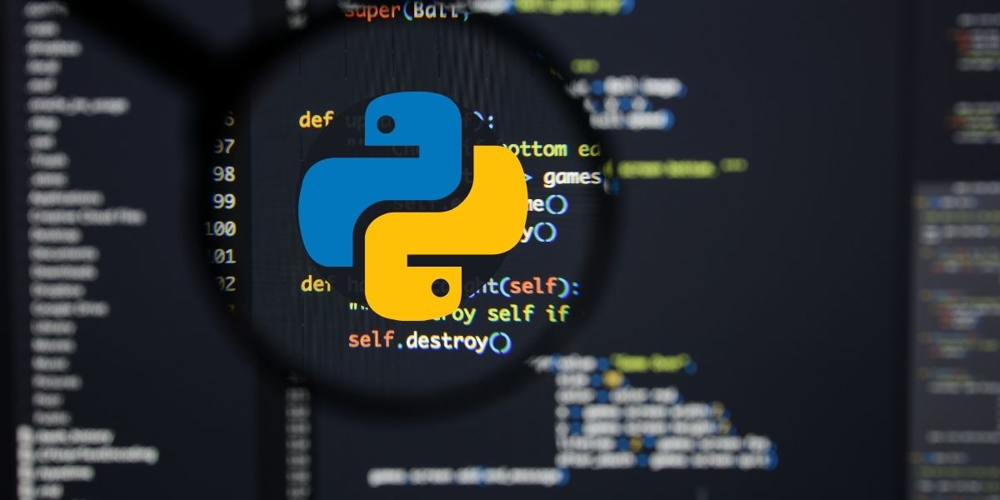
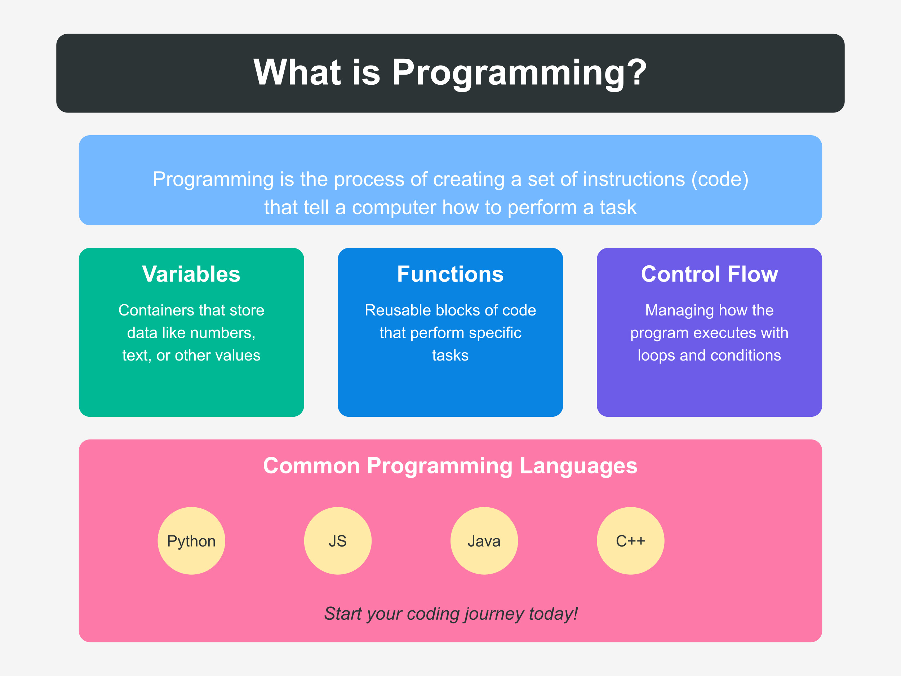
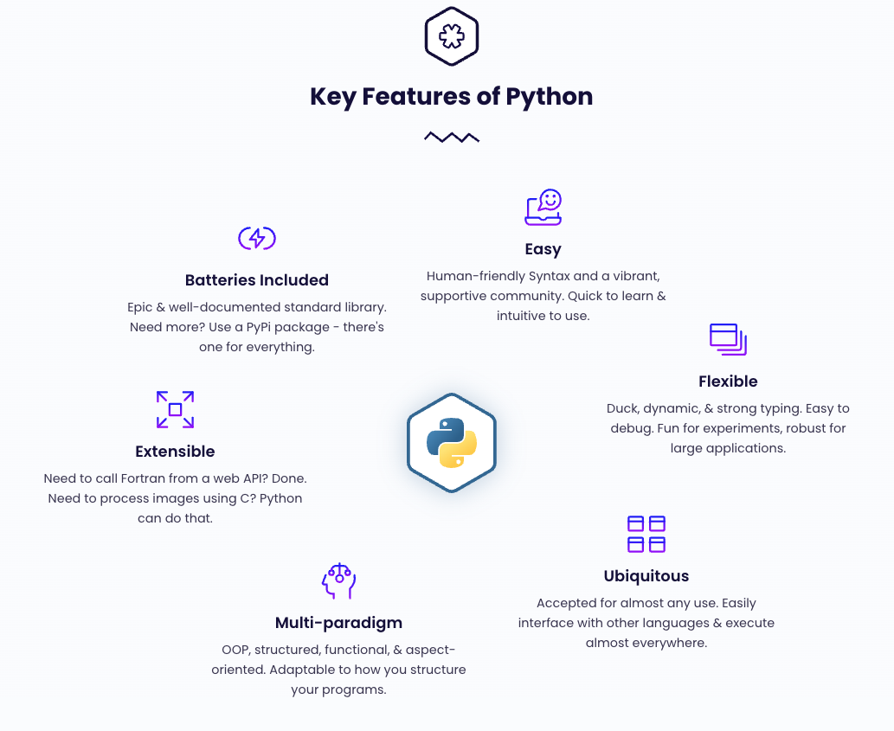
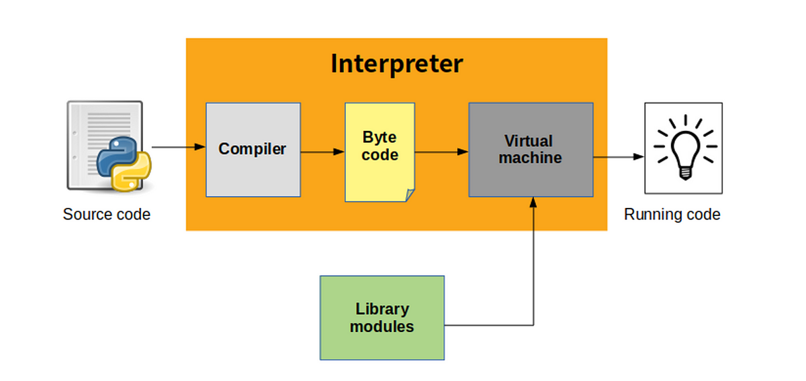

# Introduction to Python Programming
## Lesson 1: Python Basics



---
### Slide 1: What is Programming?



- Programming is the art of giving instructions to computers to solve problems
- Think of it like writing a recipe:
  - Just as a recipe has steps to make a dish
  - A program has steps (code) to solve a problem
- Programs are sets of instructions that tell computers:
  - What data to use
  - What calculations to perform
  - What decisions to make
  - What results to show

---
### Slide 2: Why Learn Python?
- **Beginner-Friendly**
  - Reads like English
  - Simple, clean syntax
  - Less complex than other languages

- **Versatile**
  - Web development
  - Data science
  - Artificial Intelligence
  - Game development
  - Automation

- **High Demand**
  - One of the most popular programming languages
  - Extensive job opportunities
  - Strong community support

---
### Slide 3: Key Features of Python
- **Readable**: Clear, simple syntax that's easy to understand
- **Interpreted**: Code runs line by line, making debugging easier
- **Dynamic Typing**: No need to declare variable types
- **Large Standard Library**: Comes with many built-in functions
- **Cross-Platform**: Works on Windows, Mac, Linux
- **Free and Open Source**: Anyone can use and modify Python
  


---
### Slide 4: Python's Underlying Architecture
- **Python Implementation Layers**:
  1. **Your Python Code**
     - The code you write
     - High-level, human-readable instructions

  2. **Python Interpreter**
     - Converts Python code to bytecode
     - Manages memory and variables
     - Handles program execution

  3. **Python Virtual Machine (PVM)**
     - Executes the bytecode
     - Provides platform independence
     - Manages memory allocation

  4. **Operating System Layer**
     - Interfaces with computer hardware
     - Handles system-level operations

- **Key Components**:
  - **Compiler**: Converts source code to bytecode
  - **Memory Manager**: Handles memory allocation and garbage collection
  - **Standard Library**: Built-in modules and functions



---
### Slide 4: Python Basics Module Overview
What you'll learn in this module:

1. **Basic Syntax**
   - How to write Python code
   - Indentation rules
   - Comments

2. **Core Concepts**
   - Variables
   - Data Types
   - Type Casting
   - Operators

3. **Control Flow**
   - Conditions (if/else)
   - Loops (for/while)
   - Exception handling

4. **Functions**
   - Creating functions
   - Parameters and returns
   - Built-in functions

---
### Slide 5: Python Basic Syntax
```python
# This is a comment - Python ignores it
print("Hello, World!")  # Your first Python program!

# Indentation is important
if True:
    print("This is indented")  # Use 4 spaces
    
# Multiple lines
name = "Alice"
age = 25
print(f"Name: {name}, Age: {age}")
```

---
### Slide 6: Variables
```python
# Variables store data
name = "John"           # String
age = 20               # Integer
height = 5.9           # Float
is_student = True      # Boolean

# Python is dynamic
x = 10          # x is an integer
x = "hello"     # now x is a string
print(x)        # Output: hello
```

---
### Slide 7: Primitive Data Types
```python
# Numbers
integer_num = 42        # int
float_num = 3.14       # float

# Strings
text = "Hello Python"   # str
char = 'A'             # still str

# Boolean
is_true = True         # bool
is_false = False       # bool

# None type
empty = None           # NoneType
```

---
### Slide 8: Conditions
```python
age = 18

# if-elif-else statement
if age < 13:
    print("Child")
elif age < 20:
    print("Teenager")
else:
    print("Adult")

# Comparison operators
# ==, !=, <, >, <=, >=
```

---
### Slide 9: Loops
```python
# For loop
for i in range(5):
    print(i)  # Prints 0 to 4

# While loop
count = 0
while count < 5:
    print(count)
    count += 1

# Loop with list
fruits = ["apple", "banana", "cherry"]
for fruit in fruits:
    print(fruit)
```

---
### Slide 10: Functions
```python
# Defining a function
def greet(name):
    return f"Hello, {name}!"

# Calling a function
message = greet("Alice")
print(message)  # Output: Hello, Alice!

# Function with multiple parameters
def add_numbers(a, b):
    return a + b

result = add_numbers(5, 3)
print(result)  # Output: 8
```
