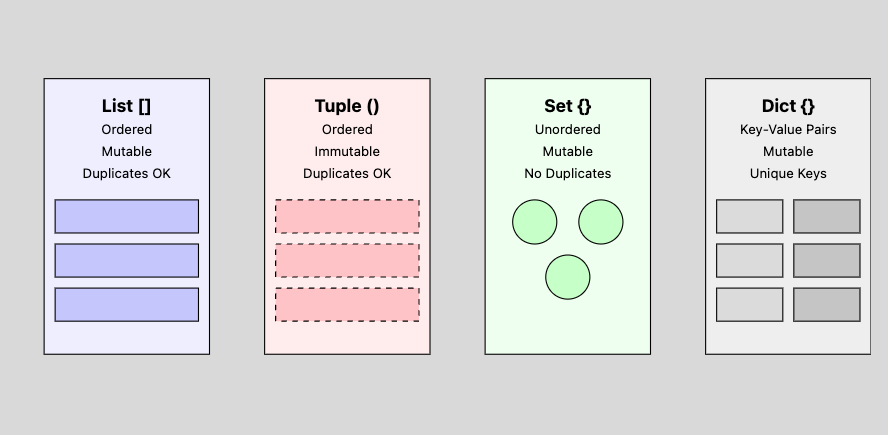
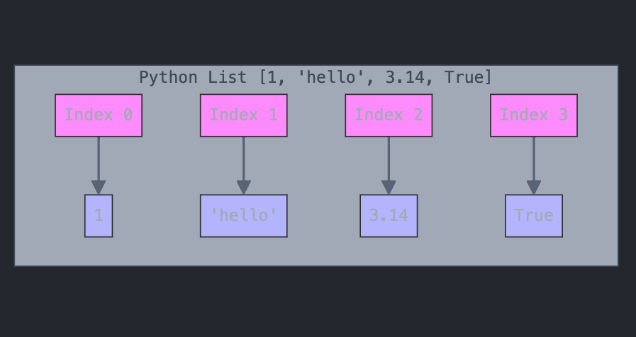
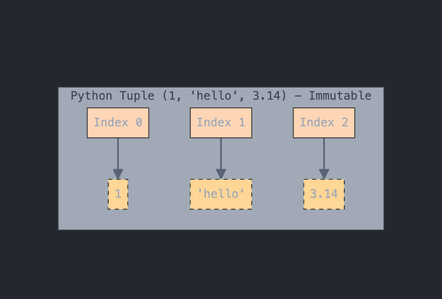
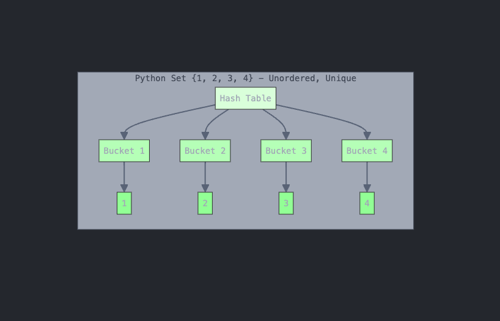
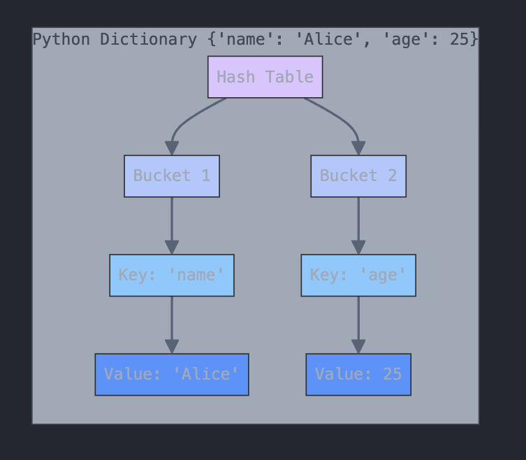

# Python Programming Basics
## Lesson 2: Types, Functions, and Data Structures

---
### Slide 1: What are Types in General?
- **Definition**: A type defines the nature of data and what operations can be performed on it

- **Why Types Matter**:
  - Help prevent errors
  - Determine valid operations
  - Affect memory usage
  - Guide data manipulation

- **Python's Basic Types**:
  ```python
  # Numbers
  x = 42        # int
  y = 3.14      # float
  
  # Text
  name = "Alice"  # str
  
  # Boolean
  is_valid = True  # bool
  
  # None
  empty = None    # NoneType
  ```

---
### Slide 2: Type Casting
- **Converting Between Types**:
  ```python
  # String to Number Conversions
  age_str = "25"
  age_num = int(age_str)      # 25 (integer)
  height_str = "1.75"
  height_num = float(height_str)  # 1.75 (float)

  # Number to String
  price = 19.99
  price_str = str(price)      # "19.99"

  # Other Conversions
  bool("True")     # True
  bool("")         # False
  int(True)        # 1
  int(False)       # 0
  float("inf")     # Infinity
  ```

---
### Slide 3: What are Exceptions?
- **Definition**: Errors that occur during program execution
- **Purpose**:
  - Handle unexpected situations
  - Prevent program crashes
  - Provide meaningful error messages

- **Common Exception Types**:
  ```python
  # TypeError
  "hello" + 42     # TypeError: can't concat str to int

  # ValueError
  int("hello")     # ValueError: invalid literal for int()

  # ZeroDivisionError
  10 / 0           # ZeroDivisionError: division by zero

  # IndexError
  list = [1, 2]
  list[5]          # IndexError: list index out of range
  ```

---
### Slide 4: How to Throw an Exception
```python
# Raising Exceptions
def divide(a, b):
    if b == 0:
        raise ValueError("Cannot divide by zero!")
    return a / b

def check_age(age):
    if age < 0:
        raise ValueError("Age cannot be negative!")
    if not isinstance(age, int):
        raise TypeError("Age must be an integer!")

# Custom Exceptions
class InvalidEmailError(Exception):
    pass

def validate_email(email):
    if "@" not in email:
        raise InvalidEmailError("Invalid email format!")
```

---
### Slide 5: How to Handle Exceptions
```python
# Basic Try-Except
try:
    num = int(input("Enter a number: "))
except ValueError:
    print("That's not a valid number!")

# Multiple Exception Types
try:
    result = 10 / num
except ZeroDivisionError:
    print("Cannot divide by zero!")
except ValueError:
    print("Please enter a valid number!")

# Try-Except-Else-Finally
try:
    file = open("data.txt")
except FileNotFoundError:
    print("File not found!")
else:
    print("File operations successful!")
finally:
    file.close()

# Catching and Using Exception Information
try:
    age = int("not_a_number")
except ValueError as e:
    print(f"Error occurred: {str(e)}")
```

---
### Slide 6: What are Functions?
- **Definition**: Reusable blocks of code that perform specific tasks

- **Benefits**:
  - Code reusability
  - Modularity
  - Easier maintenance
  - Better organization

- **Function Components**:
  ```python
  def function_name(parameters):
      """Docstring explaining what the function does"""
      # Function body
      return result
  ```

---
### Slide 7: Defining Functions
```python
# Basic Function
def greet(name):
    return f"Hello, {name}!"

# Function with Multiple Parameters
def calculate_total(price, tax_rate):
    tax = price * tax_rate
    return price + tax

# Function with Multiple Returns
def get_user_info():
    name = "Alice"
    age = 25
    return name, age

# Function with No Return (returns None)
def print_info(info):
    print(f"Info: {info}")

# Calling Functions
message = greet("Alice")
total = calculate_total(100, 0.1)
name, age = get_user_info()
```

---
### Slide 8: More on Defining Functions
```python
# Default Arguments
def create_user(name, age=18, country="Unknown"):
    return {"name": name, "age": age, "country": country}

# Keyword Arguments
def divide(dividend, divisor):
    return dividend / divisor

result = divide(divisor=2, dividend=10)

# Variable Number of Arguments
def sum_all(*args):
    return sum(args)

total = sum_all(1, 2, 3, 4, 5)

# Keyword Variable Arguments
def print_info(**kwargs):
    for key, value in kwargs.items():
        print(f"{key}: {value}")

print_info(name="Alice", age=25, city="New York")

# Special Parameters
def specific_args(pos_only, /, standard, *, kw_only):
    print(pos_only, standard, kw_only)
```

---
### Slide 9: Common Built-in Functions
```python
# Numeric Functions
abs(-42)             # 42
round(3.14159, 2)    # 3.14
max(1, 2, 3)         # 3
min([4, 5, 6])       # 4
sum([1, 2, 3])       # 6

# Sequence Functions
len("Python")        # 6
sorted([3, 1, 2])    # [1, 2, 3]
reversed([1, 2, 3])  # Iterator object
enumerate(['a', 'b']) # Iterator of (index, value)

# Type Functions
type(42)             # <class 'int'>
isinstance(42, int)  # True
id(obj)              # Object's memory address

# Conversion Functions
list("Python")       # ['P', 'y', 't', 'h', 'o', 'n']
tuple([1, 2, 3])     # (1, 2, 3)
set([1, 2, 2, 3])    # {1, 2, 3}
```

---
### Slide 10: What are Data Structures in General?
- **Definition**: Ways to organize and store data



- **Characteristics to Consider**:
  - Mutability (can be changed)
  - Order (sequence matters)
  - Uniqueness (duplicate values)
  - Access patterns (how data is retrieved)

- **Common Operations**:
  - Adding/removing elements
  - Accessing elements
  - Searching
  - Sorting

---
### Slide 11: What are Lists?
- **Definition**: Ordered, mutable sequences of elements



- **Characteristics**:
  - Ordered (maintain insertion order)
  - Mutable (can be modified)
  - Allow duplicates
  - Can contain mixed types

```python
# Creating Lists
empty_list = []
numbers = [1, 2, 3, 4, 5]
mixed = [1, "hello", 3.14, True]
nested = [1, [2, 3], [4, 5, 6]]
```

---
### Slide 12: List Methods
```python
# Modifying Lists
numbers = [1, 2, 3, 4, 5]
numbers.append(6)        # [1, 2, 3, 4, 5, 6]
numbers.extend([7, 8])   # [1, 2, 3, 4, 5, 6, 7, 8]
numbers.insert(0, 0)     # [0, 1, 2, 3, 4, 5, 6, 7, 8]

# Removing Elements
numbers.remove(5)        # Removes first occurrence of 5
last = numbers.pop()     # Removes and returns last element
numbers.pop(0)          # Removes element at index 0
numbers.clear()         # Removes all elements

# Other Operations
fruits = ['apple', 'banana', 'orange']
fruits.sort()           # Sorts in place
fruits.reverse()        # Reverses in place
index = fruits.index('apple')  # Find position
count = fruits.count('apple')  # Count occurrences

# List Comprehensions
squares = [x**2 for x in range(5)]
evens = [x for x in range(10) if x % 2 == 0]
```

---
### Slide 13: What are Tuples?
- **Definition**: Ordered, immutable sequences of elements



- **Characteristics**:
  - Ordered (maintain insertion order)
  - Immutable (cannot be modified)
  - Allow duplicates
  - Can contain mixed types

```python
# Creating Tuples
empty_tuple = ()
single = (1,)           # Note the comma
coordinates = (3, 4)
mixed = (1, "hello", 3.14)
nested = (1, (2, 3), (4, 5))
```

---
### Slide 14: Tuple Methods
```python
# Tuple Operations
point = (3, 4, 4, 5)
x = point[0]            # Accessing elements
length = len(point)     # Get length
count = point.count(4)  # Count occurrences
index = point.index(5)  # Find position

# Tuple Unpacking
x, y = (3, 4)
lat, lon = (42.1234, -71.2345)

# Multiple Assignment
name, age, city = ("Alice", 25, "New York")

# Using as Dictionary Keys
locations = {(42.1234, -71.2345): "Boston"}

# Tuple Methods vs List Methods
coords = (3, 4)
# coords.append(5)      # AttributeError
# coords[0] = 1        # TypeError
```

---
### Slide 15: What are Sets?
- **Definition**: Unordered collections of unique elements



- **Characteristics**:
  - Unordered (no fixed order)
  - Mutable (can be modified)
  - No duplicates
  - Elements must be immutable

```python
# Creating Sets
empty_set = set()
numbers = {1, 2, 3, 4, 5}
mixed = {1, "hello", 3.14}
# nested = {1, {2, 3}}  # TypeError: unhashable type
```

---
### Slide 16: Set Methods
```python
# Modifying Sets
numbers = {1, 2, 3}
numbers.add(4)          # Add single element
numbers.update([5, 6])  # Add multiple elements
numbers.remove(1)       # Remove (raises error if not found)
numbers.discard(10)     # Remove (no error if not found)
numbers.pop()           # Remove and return arbitrary element
numbers.clear()         # Remove all elements

# Set Operations
set1 = {1, 2, 3}
set2 = {3, 4, 5}

# Mathematical Operations
union = set1 | set2               # {1, 2, 3, 4, 5}
intersection = set1 & set2        # {3}
difference = set1 - set2          # {1, 2}
symmetric_diff = set1 ^ set2      # {1, 2, 4, 5}

# Method Versions
set1.union(set2)                  # Same as |
set1.intersection(set2)           # Same as &
set1.difference(set2)             # Same as -
set1.symmetric_difference(set2)   # Same as ^
```

---
### Slide 17: What are Dictionaries?
- **Definition**: Mutable collections of key-value pairs



- **Characteristics**:
  - Unordered (in Python < 3.7)
  - Mutable (can be modified)
  - Unique keys
  - Keys must be immutable
  - Values can be any type

```python
# Creating Dictionaries
empty_dict = {}
person = {
    "name": "Alice",
    "age": 25,
    "city": "New York"
}
```

---
### Slide 18: Dictionary Methods
```python
# Modifying Dictionaries
user = {"name": "Alice", "age": 25}
user["email"] = "alice@email.com"  # Add new key-value
user.update({"phone": "123-456"})  # Add/update multiple
del user["age"]                    # Remove key-value
age = user.pop("age", None)        # Remove and return
user.clear()                       # Remove all items

# Accessing Elements
name = user["name"]                # Direct access
age = user.get("age", "N/A")      # Safe access with default

# Dictionary Views
keys = user.keys()                 # View of keys
values = user.values()             # View of values
items = user.items()               # View of key-value pairs

# Dictionary Comprehension
squares = {x: x**2 for x in range(5)}

# Nested Dictionaries
contacts = {
    "Alice": {
        "phone": "123-456",
        "email": "alice@email.com"
    },
    "Bob": {
        "phone": "789-012",
        "email": "bob@email.com"
    }
}
```
